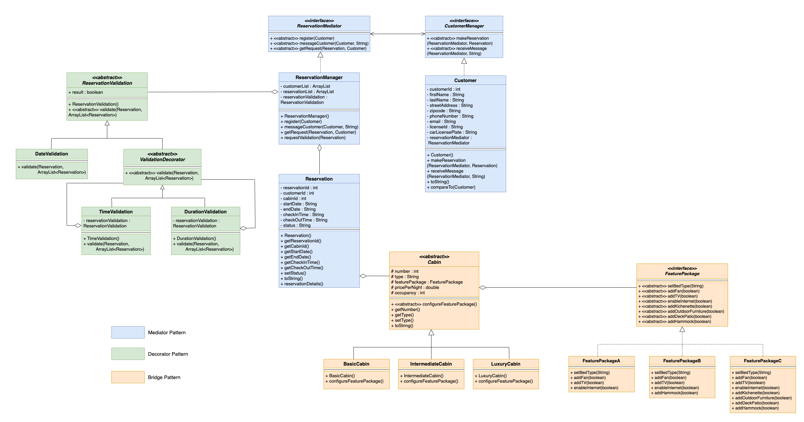

# Cabin Reservation System

# Description

Cabin Reservation System is a software designed to be used by a Customer to check and reserve a vacation Cabin. Cabin Reservation System handles following user scenario:

- Customer sends a Cabin reservation request to the Reservation Mediator.

- Reservation Mediator validates the request and confirms a valid reservation.

- Reservation Mediator sends the confirmation message back to the Customer.

- Reservation Mediator can also broadcast a promotional or generic message to the Customers.

Following design patterns were used in the implementation:

- Mediator Pattern
- Decorator Pattern
- Bridge Pattern

# Design Concepts

- ### Flexibility: 

  - Mediator Pattern - loosely coupled design by reducing the interdependency between the Class ReservationManager and Class Customer, therefore either can be modified independently.
  - Bridge Pattern – the method implementation can be modified independently. More concrete implementations can be added as subclasses.
  - Decorator Pattern – helps in adding additional validation metrics without modifying the existing ones. Also, allows us pick validation metrics of choice during runtime.
  
- ### Simplicity and Understandability:

  - Mediator Pattern - differentiates between the Class ReservationManager and Class Customer increasing understandability.
  - Bridge Pattern – separates abstraction from the implementation.
  - Decorator Pattern – The layers of validation implementation are easier to understand.
  
- ### Reusability:

  - Mediator Pattern – Interface CustomerManager can be reused by multiple concrete Customers. Interface ReservationMediator can be used to support communication among Customers.
  - Bridge Pattern – The concrete implementations can be used by Cabin subclasses in various combinations.
  - Decorator Pattern – Existing reservation validation metrics can be enhanced to add more.
  
- ### Information Hiding:

  - The ValidationDecorator interface hides additional functionalities that may occur during runtime.

- ### Relationship design choices with other classes:

  - Class DateValidation is a subclass of Class ReservationValidation. (Inheritance Relationship)
  - Class ValidationDecorator has subclasses - Class TimeValidation and Class DurationValidation. (Inheritance Relationship)
  - Class ReservationValidation is a-part-of Class ReservationManager. (Aggregation Relationship)
  - Class ReservationManager implements interface ReservationMediator and Class Customer implements interface CustomerManager.
  - Class FeaturePackage is a-part-of abstract Class Cabin. (Aggregation Relationship) 
  - Class BasicCabin, Class IntermediateCabin and Class LuxuryCabin are subclasses of Class Cabin. (Inheritance Relationship)
  - Class FeaturePackageA, Class FeaturePackageB and class FeaturePackageC implement interface Class FeaturePackage.

# Assumptions

* A Customer enters a reservation information and sends a request to the ReservationMediator.

* The ReservationManager validates the request based on following criteria -

  * DateValidation - checks if a Cabin is available on the requested date. Also, ensures end date comes after start date.
  * TimeValidation - checks if check-in time is 15:00 and check-out time is 11:00.
  * DurationValidation - checks if the period of stay is two days assuming a reservation has to be exactly for two days.

* ReservationManager communicates with Customer via ReservationMediator and CustomerManager and vice versa.

* There are three different types of Cabins - BasicCabin, IntermediateCabin and LuxuryCabin.

* FeaturePackages are three types - FeaturePackageA, FeaturePackageB, and FeaturePackageC.

* A concrete FeaturePackage has various components and assumed to have equipment of different brands.

* Each Cabin type can be associated with various FeaturePackages.

* ReservationMediator can broadcast generic messages such as promotional messages to one or more customers.

* As an enhancement, a customer can interact with other customers too.

  ### UML Diagram

  

#### Other design patterns considered but not implemented due to following reasons:

- Observer Pattern - To achieve an easy two communication between the ReservationManager and Customer a Mediator Pattern was chosen over the Observer Pattern. Also, with the Mediator pattern the implementation can be enhanced to allow customers to interact with each other regarding a reservation or an event.
- Strategy Pattern - For validation of Reservation request Decorator Pattern was chosen over Strategy Pattern as all the validation steps can be chosen dynamically and not restricted to just one validation process.

# Project Template

This is a Java Maven Project Template


# How to compile the project

We use Apache Maven to compile and run this project. 

You need to install Apache Maven (https://maven.apache.org/)  on your system. 

Type on the command line: 

```bash
mvn clean compile
```

# How to create a binary runnable package 


```bash
mvn clean compile assembly:single
```


# How to run

```bash
mvn -q clean compile exec:java -Dexec.executable="edu.bu.met.cs665.Main" -Dlog4j.configuration="file:log4j.properties"
```

We recommand the above command for running the Main Java executable. 


# Run all the unit test classes.


```bash
mvn clean compile test checkstyle:check  spotbugs:check
```

# Using Spotbugs to find bugs in your project 

To see bug detail using the Findbugs GUI, use the following command "mvn findbugs:gui"

Or you can create a XML report by using  


```bash
mvn spotbugs:gui 
```

or 


```bash
mvn spotbugs:spotbugs
```


```bash
mvn spotbugs:check 
```

check goal runs analysis like spotbugs goal, and make the build failed if it found any bugs. 


For more info see 
https://spotbugs.readthedocs.io/en/latest/maven.html


SpotBugs https://spotbugs.github.io/ is the spiritual successor of FindBugs.


# Run Checkstyle 

CheckStyle code styling configuration files are in config/ directory. Maven checkstyle plugin is set to use google code style. 
You can change it to other styles like sun checkstyle. 

To analyze this example using CheckStyle run 

```bash
mvn checkstyle:check
```

This will generate a report in XML format


```bash
target/checkstyle-checker.xml
target/checkstyle-result.xml
```

and the following command will generate a report in HTML format that you can open it using a Web browser. 

```bash
mvn checkstyle:checkstyle
```

```bash
target/site/checkstyle.html
```


